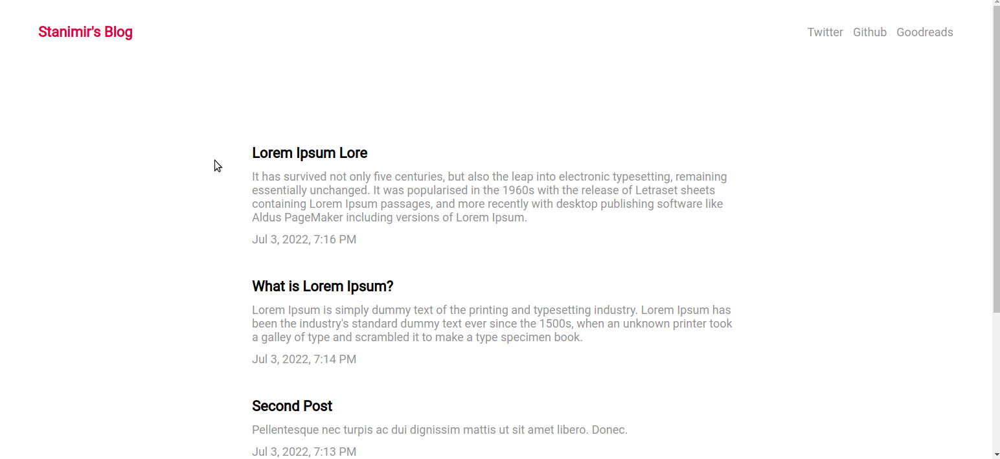

# odin-blog-api

The Odin Project Curriculum - Full Stack JavaScript Path - NodeJS Section - Project Nº25

Goal: Create an API only backend with two front-ends, one for reading and commenting and the other for writing, editing and publishing blog posts.

## Technologies:

- MERN Stack (MongoDB, ExpressJS, React, Node.js)

[Cliet demo](https://stanimirkosev.github.io/odin-blog-api/)

## CMS(Content management system) gif

## Client gif

