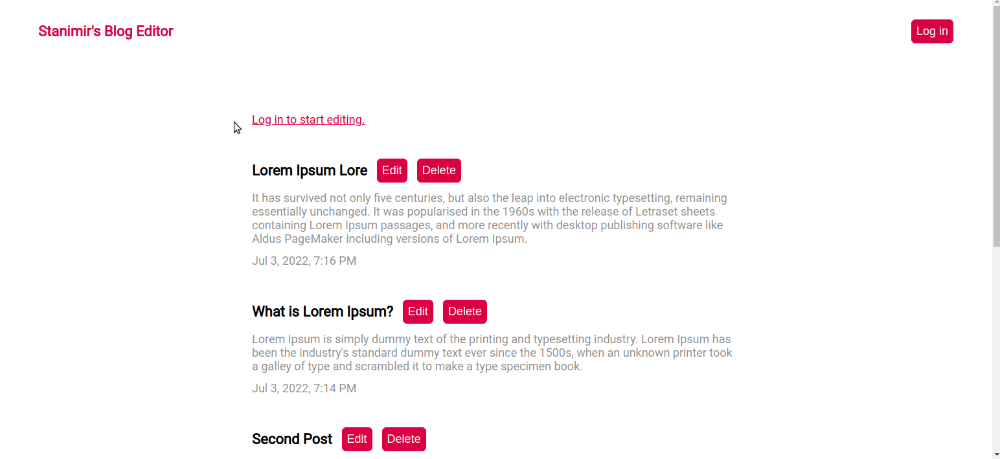

# odin-blog-api

The Odin Project Curriculum - Full Stack JavaScript Path - NodeJS Section - Project Nº25

Goal: Create an API only backend with two front-ends, one for reading and commenting and the other for writing, editing and publishing blog posts.

## Technologies and tools:

- MERN Stack (MongoDB, ExpressJS, React, Node.js)
- JSON Web Token
- Bcryptjs

## Features:

- Dark Theme
- Mobile Responsivness

## [Client demo](https://stanimirkosev.github.io/odin-blog-api/) :wave:

## The frontend for writing,editing and publishing. (cms folder)

## The frontend for reading and writing comments. (client folder)

